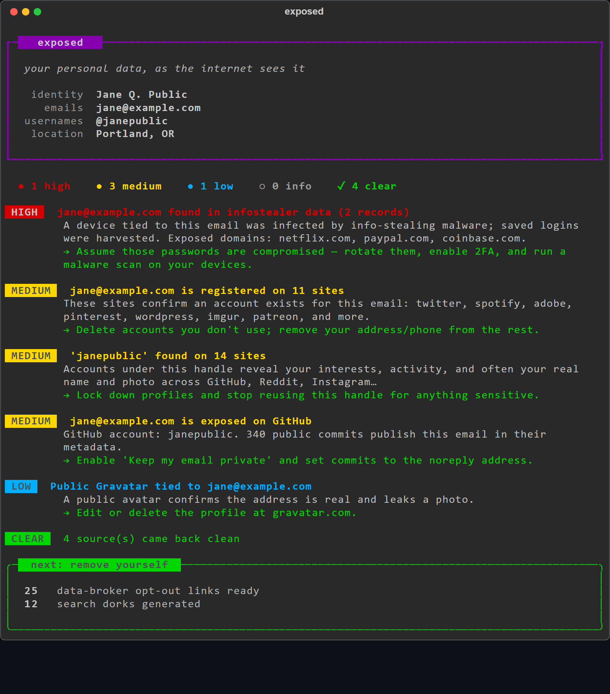

# exposed

**Find what of your personal data is leaking online — then remove it.**

`exposed` is a personal OSINT self-scan. Point it at your own name, emails, and
usernames, and it checks **free, no-account, no-API-key** public sources to show
where your information is exposed — then hands you **one-click opt-out links** for
the data brokers holding it.

It only ever looks *you* up. No targets, no accounts, no keys, no data leaves your
machine except the lookups themselves.

<p align="center">
  
</p>

<p align="center"><sub>Example scan of a fictional identity — real output is color-coded by severity.</sub></p>

## What it checks

| Source | What it finds |
|---|---|
| **Gravatar** | Is your email tied to a public profile (photo, name, linked accounts)? |
| **Hudson Rock** | Does your email/username appear in infostealer-malware logs? |
| **GitHub** | Is your email leaking through public commits or linked to a user? |
| **holehe** *(optional)* | Which sites have an account registered to your email? |
| **Sherlock** *(optional)* | Which sites have an account under your username? |
| **Data brokers** | Ready-made search + opt-out links for 25 people-search sites |
| **Search dorks** | Pre-built Google / DuckDuckGo queries to eyeball the rest |

## Install

```bash
git clone https://github.com/GreenHarvestDev/exposed.git
cd exposed
pip install -e .          # core scan (standard library only)
pip install -e ".[full]"  # + holehe & Sherlock for the deeper account sweeps
```

## Usage

1. Copy the example config and fill in **your own** details:

   ```bash
   cp exposed_identity.example.json exposed_identity.json
   # edit exposed_identity.json
   ```

2. Run the scan:

   ```bash
   exposed                 # readable summary + saves exposed_report.json
   exposed --no-sherlock   # skip the slow username sweep
   exposed --json          # emit the full report as JSON (for your own UI)
   ```

Your `exposed_identity.json` and any `*_report.json` are **git-ignored** — they hold
your PII and should never be committed.

## Identity file

```json
{
  "full_name": "Jane Q. Public",
  "emails": ["jane@example.com"],
  "usernames": ["janepublic"],
  "phones": ["555-123-4567"],
  "cities": ["Springfield"],
  "state": "OR",
  "aliases": ["Jane Doe"],
  "relatives": ["John Public"]
}
```

Everything is optional — provide what you want scanned. More detail = more thorough
dorks and broker links.

## Ethics & scope

`exposed` is a **defensive privacy tool**. It is designed to scan *your own*
identity so you can reduce your attack surface and remove yourself from data
brokers. Don't use it to profile other people.

All sources are public and free; the tool sends no data to any server it doesn't
have to query for a lookup, and stores results only in the local report file you
control.

## License

MIT © 2026 GreenHarvestDev
